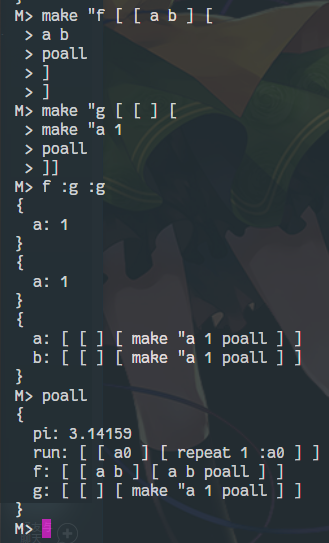
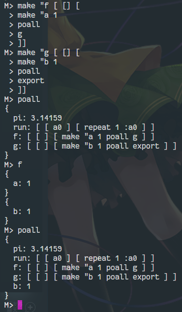
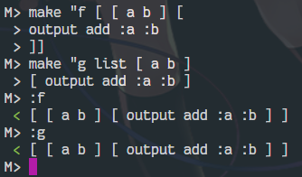
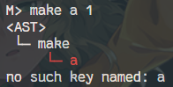
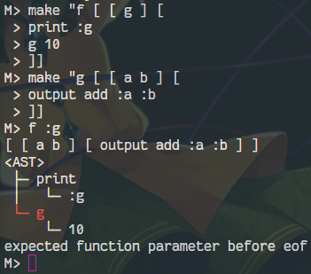
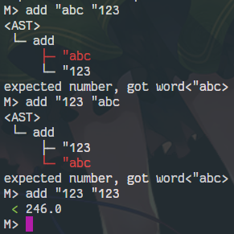
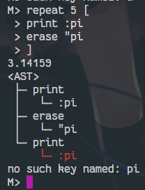

# Mua解释器第二阶段设计

菅浩然 3160104500

## 1. 综述

本阶段的设计内容主要包括函数和列表，要求实现的指令共有`readlist`，`repeat`，`output`，`stop`，`export`，`isnumber`，`isword`，`islist`，`isbool`，`isempty`，`random`，`sqrt`，`int`共13条。其中，对Number和Bool的类型从属有了新规定，所以还包含对类型系统的重构环节。

运行时请确保您的Java版本不低于10。

## 2. 类型系统

新标准认为Number与Bool是Word的特例，且作为字面量，`"number`与`number`等价，`"bool`与`bool`等价。因为Number和Bool是Word的特例，那它们必然支持Word支持的所有操作。在新版类型系统中，去掉了Number与Bool这两个类，取而代之的是Value类的四个方法：`asNumber`，`asWord`，`asBool`，`asList`。从`double`和`boolean`构造`Word`时将其转换为`String`，从`Word`中取值时用`Double.parseDouble`和`Boolean.parseBoolean`。

另外，由于Number之间运算可能返回非Number，如除0，根号-1等。这时应当抛出异常。

## 3. 列表

由于Mua中的列表是可执行的，所以在处理列表时应该将解析到的东西原样放进列表中。列表中的物品要么是字，要么是列表，其中字又可以包括字面量`".*`，值`:.*`和字`.*`。在经过Preprocessor和Lexer预处理后产生Token列表，Parser负责将Token列表中的递归表结构去除。

## 4. 函数

根据Mua类型系统的定义，函数并不是新类型，而是一个包含两个列表 且第一个列表全是字的列表。这样，我们可以让内建函数和列表都实现`Callable`接口，其中`Callable`接口如下：

```java
interface Callable {
	int getParamCount();
	Value execute(Facility facility, ArrayList<Value> params, Context context) throws Exception;
}
```

顾名思义，`getParamCount()`返回参数的个数，`execute()`方法由给定的参数和context执行相应的函数。注意到类型检查只出现在内建函数，所以在`Callable`被调用的时候并不需要做，而是留给`BuiltinFunction`自己检查；但要检查参数是否为`null`，因为某些内建函数不返回值，若为`null`则抛出`null in function argument`异常。

在调用List时先检验其满足成为函数的条件，再调用，若不满足，则抛出异常`expected callable list, got list`。

另外，在调用函数时要进入函数的命名空间，执行List时不进入新命名空间。

命名空间要求有两层：本地命名空间和全局命名空间。每进入一个函数（内建函数不算）时，创建一个新的空命名空间`Map<String, Value>`。`make`总写入当前命名空间，取命名空间中的值或`erase`时，如果本地命名空间不存在，则查找全局命名空间。基本操作作为全局命名空间中的项储存在全局命名空间中，但在`poall`和`erall`时做了特殊判断，使其不会被打印出来，但可以被`erase`或覆盖。函数的参数作为函数命名空间中的普通名字，在调用的参数绑定时写入函数的命名空间。因为函数不能访问调用它的函数的命名空间，所以不能实现闭包。`export`操作将所有当前命名空间中的名字写入全局命名空间。为了使命名空间中的值存放顺序与加入顺序一致，使用`LinkedHashMap`而不是`HashMap`来存储，有关命名空间的测试如下：

*二层命名空间*



*测试export*



可以发现`export`只将`g`的命名空间写入了全局命名空间。

另外，命名空间中还包含一个特殊的字段`result`来存储函数的返回值，`output`操作只需写入`result`字段，调用者就可以检查`result`来获得函数的返回值。

函数停止通过抛出`FunctionStop`类型的异常来实现，在函数调用时添加一个`try-catch`对来捕获`FunctionStop`类型的异常，如果捕获则正常退出。

*callable list的execute方法*

```java
@Override
public Value execute(Facility facility, ArrayList<Value> params, Context context) throws Exception {
    if (!isFunction) {
        throw new InternalException();
    } else {

        if (params.size() != this.params.size()) {
            throw new InternalException();
        }
        var inner = new Context(context, true);
        for (int i = 0; i != params.size(); ++i) {
            facility.astBuilder.push(facility.astBuilder.top().children.get(i));
            Util.putArg(this.params.get(i), params.get(i), inner);
            facility.astBuilder.pop();
        }

        facility.astBuilder.push(new Tree("function"));		// enter builder

        List executable = (List)value.get(1);
        try {
            executable.execute(facility, inner);
        } catch	(FunctionStop stop) {
            // do nothing
        } catch (EOFException e) {
            throw new Exception(e.getMessage());
        }

        facility.astBuilder.pop();					// leave builder

        return inner.getResult();
    }
}
```


## 5. 用户交互

考虑到书写函数时有列表分布在多行的情况，为了使这种情况下的用户体验更友好，在Parser和Processor检测到AST未完成时会抛出`EOFException`。Interpreter可以选择捕获该异常，保存上次输入的内容，并且提示用户输入未完成。当Interpreter下次接到输入时会将两段代码拼在一起重新parse，这样就可以实现多行的列表输入，如图：



为了使Mua运行时抛出的错误信息更加易于理解，使用可视化方法打印错误所在列表的语法树。ASTBuilder类保存执行到AST当前节点的堆栈，Tree将AST节点连接形成语法树，并实现了打印方法。其中为了更直观地显示错误位置，使用JAnsi库对Ansi终端进行了颜色调整（依赖库在Maven工程的Dependency中），可视化效果如图：

*尝试用字作为make的第一个参数*



*尝试进行参数个数不匹配的函数调用*



*尝试进行类型不匹配的基本操作*



*在循环中进行错误提示，显示展开后的语法树*

